  <b>Research group led by <a href="https://github.com/sara-shaf">Sara Shafiee</a> · Technical University of Denmark (DTU)</b> 
  📍 Copenhagen, Denmark

### 🔬 What we work on

We build and evaluate AI for complex engineering and manufacturing problems: agentic and multi-agent LLM systems, LLM-as-a-judge evaluation, constraint programming and product configuration, and recommendation systems for engineer-to-order product design.

### 🚀 Projects

| Project | Description |
|---|---|
| [**RECODE**](https://github.com/Sara-Shafiee-lab/RECODE) | Revolutionizing engineer-to-order companies with deep learning and advanced recommendation systems for product design. Funded by the Independent Research Fund Denmark (DFF); PI: Sara Shafiee |

### 📄 Research code from the lab

| Paper | Venue | Code |
|---|---|---|
| CPJudgeBench: Meta-Evaluation of LLM Judges for Constraint Programming through Solution-Space Semantics | EMNLP 2026 (Main) | [Nastaran95/CPJudgeBench](https://github.com/Nastaran95/CPJudgeBench) |
| Evaluating Agentic AI Systems in Manufacturing: A Review of Taxonomy, Challenges, and Future Directions | AAIML 2026 | [Nastaran95/manufacturing-agentic-evaluation](https://github.com/Nastaran95/manufacturing-agentic-evaluation) |
| Agentic Data Analysis for Intelligent Manufacturing: Benchmark-Driven Evaluation of Agentic vs. Direct LLM Approaches | CIRPe 2025 | [Nastaran95/agentic-man-da](https://github.com/Nastaran95/agentic-man-da) |
| Advancing reliable evaluation of AI-generated constraint models | 🔒 Coming soon | [CPJudgeBenchPlus](https://github.com/Nastaran95/CPJudgeBenchPlus) |
| Understanding how AI is used to evaluate code | 🔒 Coming soon | [meta-eval-for-code](https://github.com/Nastaran95/meta-eval-for-code) |
| AI agents for analysing building information models | 🔒 Coming soon | [SmartBIM-Agent](https://github.com/Nastaran95/SmartBIM-Agent) |

Code maintained by <a href="https://github.com/Nastaran95">Nastaran Moradzadeh Farid</a>, PhD student in the lab.

### 🤝 Join us

> [!TIP]
> We welcome students and researchers: MSc thesis projects, PhD and postdoc positions, visiting researchers, and research collaborations.
>
> 📫 **sashaf [at] dtu [dot] dk** · 🌐 [sara-shaf.github.io](https://sara-shaf.github.io)
